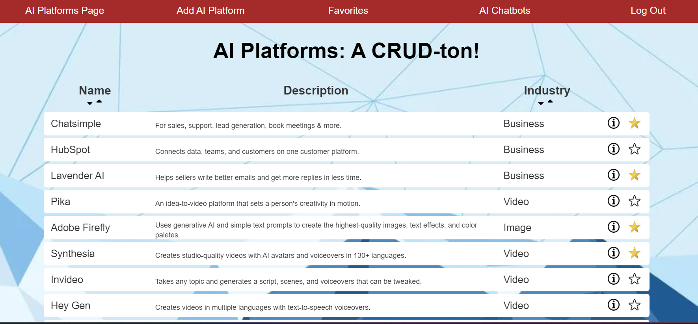
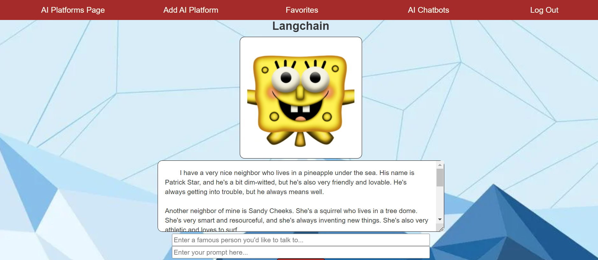
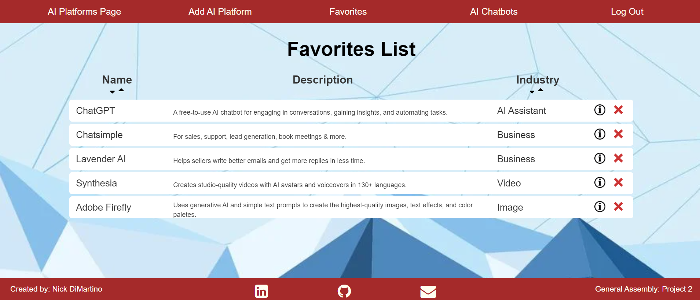

# <h1 align="center">AI Platforms: A CRUD-ton!</h1>
#### <h3 align="center"><a href="https://ai-platforms-list-crud-64ab4f9bb249.herokuapp.com/platforms">Play on Heroku!</a></h3>

  
  

## 📝Description
This is a CRUD (Create, Replace, Update, Delete) app centered around popular AI Platforms as of March 2024. Using MongoDB, OAuth, and Passport with Google Strategy, users can sign-in and add or remove AI Platforms from their favorites list.  Only the app creator can permanently remove AI Platforms from the overarching list.  Jest tests and Postman were used to verify working CRUD functionality of HTTP requests.  As a bonus, users can visit the AI Chatbots page to utilize the Groq API and OpenAI API to try out AI chatbots.  The OpenAI API was used for image generation and Langchain was used to personalize the chatbot to respond as a personalized person.  LlamaIndex can be configured to utilize Retrieval-Augmented Generation (RAG) if needed.

## 🖼️ Screenshots

 
 📊 Browser Pages

 
 | Description | Screenshot |
 |------------ | ------------|
 | <h3 align="center">Home Page</h3> | 
 | <h3 align="center">AI Chatbots Page</h3> | 
 | <h3 align="center">Favorites List</h3> | 
 

## 💻 Technologies Used

## 💻 AI Technologies Used
- Groq
- OpenAI
- LangChain
- LlamaIndex
- Retrieval-Augmented Generation (RAG)

## ⚛️ Getting Started
### 📲 Instructions

How to View AI Platforms

1. Open app entry, a list of platforms are visible.  The list can be sorted in ascending or descending order by name and industry.
 
2. Click a star on an AI platform to add it to your favorites list.
 
3. Click the i icon on an AI platform to view more details about that AI platform.

4. AI platforms that have been favorites will show up in your favorites list on the "Favorites" Page.

Using the AI Chatbots

1. Navigate to the nav bar on top of the screen and click "AI Chatbots".
 
2. Four API's have been implemented using OpenAI, Groq, LLamaIndex, and LangChain.
 
3. Enter prompts into the fields to generate AI prompts based on your entry.

Deployed Link (Heroku)

<a href="https://ai-platforms-list-crud-64ab4f9bb249.herokuapp.com/platforms">https://ai-platforms-list-crud-64ab4f9bb249.herokuapp.com/platforms</a>

Trello Board

<a href="https://trello.com/invite/b/wxJJovTM/ATTIe2671fe1c19bf987e8e016b85b7b29e5F84E9127/ai-program-list">https://trello.com/invite/b/wxJJovTM/ATTIe2671fe1c19bf987e8e016b85b7b29e5F84E9127/ai-program-list</a>

# Next Steps

- [ ] Find and fix possible bugs
- [ ] Refactor code
